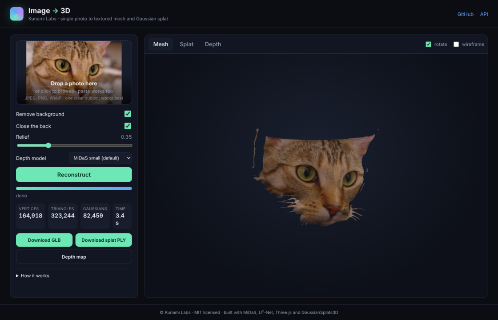
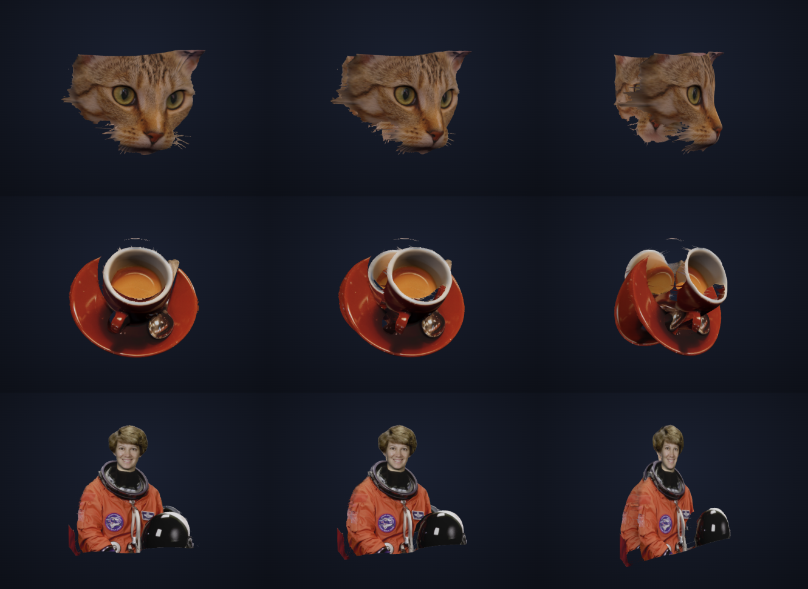
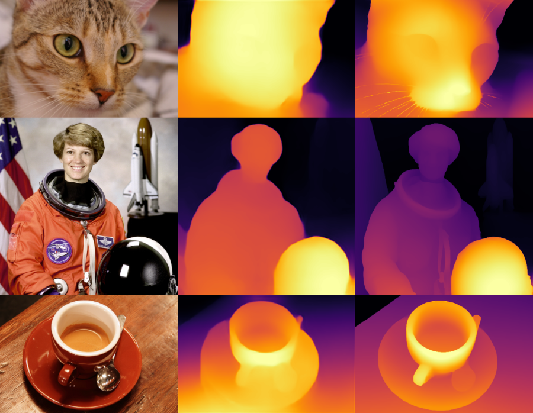
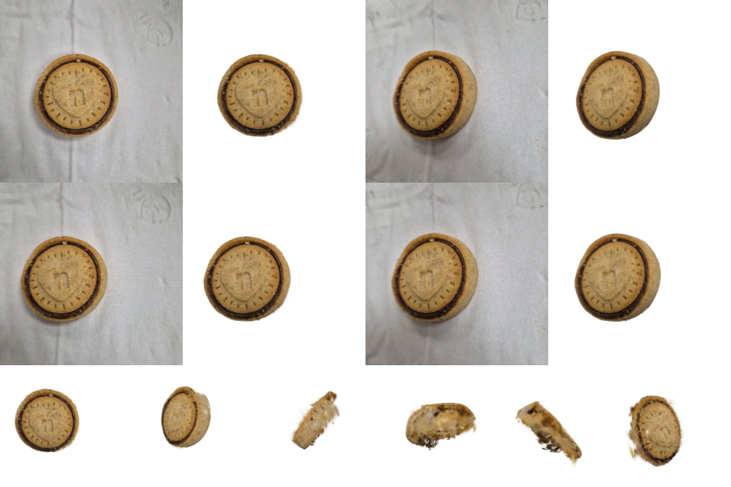
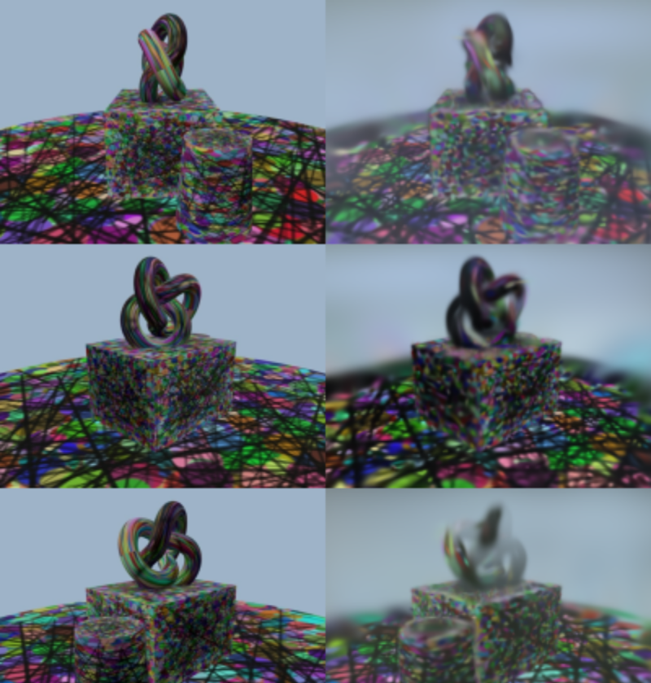
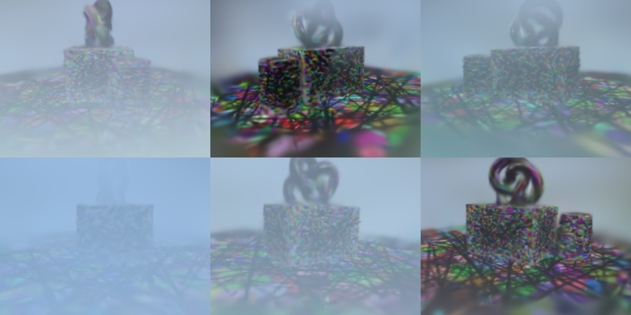

# Image-to-3D

**Upload one photo, get a 3D model back.** A web app and Python toolkit by [Kunami Labs](https://github.com/NicholasTJL-projects) that turns 2D images into 3D: a single photo becomes a textured mesh and a Gaussian splat in a few seconds on a CPU, and a walk-around video becomes a full Gaussian Splatting scene.

```
photo ──► segment subject ──► predict depth ──► back-project ──► textured mesh (GLB)
                                                              └─► 3D Gaussians (PLY)
```



The browser shows the result in an interactive viewer (orbit, zoom, wireframe), with a splat view and the depth map, and offers the GLB and PLY for download. The GLB opens in Blender, Three.js, Unity, iOS Quick Look and any glTF viewer; the PLY opens in SuperSplat and other splat viewers.

## Run it

```bash
pip install -e ".[web,dev]"      # core + MiDaS depth + U²-Net segmentation + tests
image-to-3d-web                  # http://localhost:8000
```

The first run downloads the model weights into `~/.cache`: Depth Anything V2 small (99 MB) from this repository's [models release](https://github.com/NicholasTJL-projects/Image-to-3D/releases/tag/models-v1), MiDaS small (86 MB) from the MiDaS release, and U²-Net (176 MB) from the rembg release. No Hugging Face account or access is needed. Install PyTorch first with `pip install torch --index-url https://download.pytorch.org/whl/cpu` if you want the small CPU build.

With Docker, weights are baked into the image:

```bash
docker compose up --build        # http://localhost:8000
```

Then open the page, drop in a photo of a single subject, and press **Reconstruct**.

## Static site (Vercel)

The Python backend needs a server, but the results gallery and the app's front end are static.
`site/` holds them, assembled by `scripts/build_site.py`, and `vercel.json` points Vercel at that
folder with no build step. On a static host the app page shows how to connect a backend; set
`window.IMAGE_TO_3D_API` in `site/app/config.js` to a hosted API's URL to make it live.

## How it works

| Step | What happens | Code |
|------|--------------|------|
| 1. Segment | The subject is cut out with U²-Net via `rembg`; if that is not installed, OpenCV GrabCut seeded from the image border is used. Uploads with an alpha channel use it as the mask. The largest component is kept and holes are filled. | `image_to_3d/single_image.py` |
| 2. Depth | Depth Anything V2 small (DINOv2-S, 25 M parameters) predicts relative inverse depth with sharp silhouettes; it is the default. MiDaS v2.1 small (EfficientNet-Lite3) is the fallback, with its network definition vendored so no `torch.hub` access is needed. A model-free "inflate" option puffs the silhouette like a pillow when no weights are available. | `image_to_3d/depth.py` |
| 3. Back-project | Each pixel is unprojected through a pinhole camera with an assumed field of view. The `relief` slider sets the depth range as a fraction of the object's width. Silhouette edges are pushed back slightly so cut-outs do not flare towards the viewer. | `back_project` |
| 4. Mesh | The pixel grid is triangulated, skipping triangles across depth discontinuities and outside the mask, textured with the photo, and optionally mirrored to close the back. Exported as GLB with `trimesh`. | `build_mesh`, `export_glb` |
| 5. Splat | The same points become 3D Gaussians sized to their pixel footprint, written in the reference 3DGS PLY layout. | `build_splat` |

A single photo has no information about the hidden sides of an object, so the output is a relief ("2.5D") model that looks right from the front and plausible from the sides. For a real 3D capture, use the multi-view pipeline below.



Depth Anything V2 (right) against MiDaS small (middle) on the same photos; the sharper silhouettes are why it is the default:



### Web API

```
GET  /api/health                 available backends on this server
POST /api/jobs                   multipart: image, remove_background, relief, mirror_back, depth_backend, fov_deg
GET  /api/jobs/{id}              status, progress, stage, result file names, mesh statistics
GET  /api/jobs/{id}/files/{name} model.glb · splat.ply · depth.png · mask.png · depth16.png · meta.json
POST /api/jobs/multiview         images[] or video (+ object_only) -> Gaussian Splatting scene (needs COLMAP + torch)
```

Interactive docs at `/api/docs`. Jobs run on a worker thread and are persisted under `IMAGE_TO_3D_JOBS` (default `./jobs`); results are deleted after 24 hours.

Environment variables: `IMAGE_TO_3D_MAX_SIDE` (working resolution, default 512), `IMAGE_TO_3D_MAX_UPLOAD_MB` (25), `IMAGE_TO_3D_WORKERS` (1), `IMAGE_TO_3D_DEVICE` (`cpu` or `cuda`), `IMAGE_TO_3D_CACHE` (weights directory), `IMAGE_TO_3D_MULTIVIEW` (`auto`, `0`, `1`).

### Python API

```python
from image_to_3d.single_image import reconstruct, SingleImageConfig

result = reconstruct("photo.jpg", SingleImageConfig(relief=0.4))
result.save("out/")          # out/model.glb, out/splat.ply, out/depth.png, ...
```

## Multi-view capture

For a real 3D capture, the object has to be seen from many angles. The web app offers three ways
to get there when the server has COLMAP and PyTorch: **guided capture** (the page takes a
full-resolution still from the phone camera every half second while you walk around, with a
coverage counter), a **walk-around video** (the sharpest 80 frames are extracted), or a folder of
**photos**. Aim for 40 to 80 views in two loops at different heights with about 70 % overlap
between neighbours.

**Object-only mode** (on by default) segments the subject in every posed photo, trains against a
random background so off-object Gaussians fade out, and deletes Gaussians that project outside the
silhouette in two or more views. Without it, a plain background has no texture to fix its depth and
becomes floating blobs. COLMAP still needs features to pose the cameras, so a patterned surface
under the object helps even in object-only mode.

A real test: 14 phone photos of a biscuit on a white napkin. Without object-only mode the napkin
became white floaters (27 dB held-out PSNR); with it, only the biscuit remains (35 dB). The capture
covered 114° of the circle, so the far side is thin, which the coverage check reports to the user.



The same pipeline runs from the CLI:

```bash
image-to-3d capture photos/ workspaces/desk           # photos -> images/ (also accepts a video)
image-to-3d sfm     workspaces/desk --matcher exhaustive   # COLMAP poses + sparse points
image-to-3d init    workspaces/desk                   # seed Gaussians from the points
image-to-3d train   workspaces/desk --iterations 7000 --object-only  # optimise (PyTorch; gsplat on a GPU)
image-to-3d render  workspaces/desk --views orbit --video
image-to-3d demo    workspaces/demo                   # synthetic end-to-end run, no footage needed
```

It includes a NumPy reference rasteriser, a differentiable pure-PyTorch rasteriser, the training loop (L1 + D-SSIM, densification, pruning, opacity resets) and COLMAP model readers. The pure-PyTorch path is for development and small scenes; install `gsplat` for real scenes on an NVIDIA GPU. [COLMAP](https://colmap.github.io/install.html) is an external binary and only needed for the `sfm` stage. Settings live in `configs/default.yaml`.

Capture tips: keep the subject and lighting fixed, move the camera rather than the object, overlap neighbouring photos by about 70 %, cover the top and all sides, and avoid glass, mirrors and plain walls.

Result of that pipeline on the synthetic 36-photo set below, trained for 600 iterations at quarter
resolution on 4 CPU cores (13 minutes): source photo on the left, Gaussian Splatting render of the same
camera on the right. Longer training, full resolution and a GPU rasteriser sharpen it considerably.



Novel views from the `render --views orbit` turntable of the same scene:



### Testing the multi-view pipeline without real photos

`scripts/make_synthetic_photoset.py` renders a textured scene from 36 camera positions with
Three.js in headless Chromium, which gives COLMAP plenty of features to match:

```bash
pip install playwright && playwright install chromium
python scripts/make_synthetic_photoset.py /tmp/mv/photos
image-to-3d capture /tmp/mv/photos /tmp/mv/ws --min-blur 0
image-to-3d sfm     /tmp/mv/ws --matcher exhaustive          # ~2 min on 4 CPU cores
image-to-3d train   /tmp/mv/ws --iterations 600 --downscale 4 --max-gaussians 30000
image-to-3d render  /tmp/mv/ws --views orbit --video
```

COLMAP builds without CUDA (the Ubuntu package, for example) are detected automatically and
SIFT runs on the CPU. On Ubuntu/Debian: `sudo apt-get install -y colmap`.

## Project layout

```
image_to_3d/
  single_image.py   photo -> mask -> depth -> mesh + splat
  depth.py          Depth Anything V2 (default), MiDaS small (vendored), inflate fallback
  web/server.py     FastAPI backend          web/jobs.py   on-disk job queue
  web/static/       frontend (vanilla JS, Three.js, GaussianSplats3D; vendored, no CDN)
  capture.py        frame extraction + blur filtering
  colmap.py         COLMAP wrapper           colmap_io.py  .bin/.txt model readers
  gaussians.py      Gaussian cloud + 3DGS PLY I/O
  render_np.py      NumPy reference rasteriser
  render_torch.py   differentiable PyTorch rasteriser (+ gsplat backend)
  train.py          3DGS training loop (object-only: masked loss + visual-hull pruning)
  masks.py          per-photo subject masks and visual-hull filter
  cli.py            image-to-3d command
scripts/            synthetic photo-set generator, full-pipeline shell script
tests/              pytest suite (renderers, I/O, segmentation, mesh, web API)
Dockerfile          CPU image with weights baked in
```

## Development

```bash
pytest -q                                   # ~45 tests, a few seconds
image-to-3d demo /tmp/demo --iterations 300 # synthetic Gaussian Splatting run
uvicorn image_to_3d.web.server:app --reload # dev server
```

Conventions: cameras follow COLMAP/OpenCV (`x_cam = R x_world + t`, +Z forward, +Y down); meshes and splats use glTF axes (+Y up, +Z towards the viewer); quaternions are `(w, x, y, z)`.

## Credits

* Yang et al., *Depth Anything V2*, NeurIPS 2024 (small model, Apache-2.0).
* Ranftl et al., *Towards Robust Monocular Depth Estimation: Mixing Datasets for Zero-shot Cross-dataset Transfer* (MiDaS), TPAMI 2022.
* Qin et al., *U²-Net: Going Deeper with Nested U-Structure for Salient Object Detection*, Pattern Recognition 2020, via `rembg`.
* Kerbl et al., *3D Gaussian Splatting for Real-Time Radiance Field Rendering*, SIGGRAPH 2023.
* Schönberger & Frahm, *Structure-from-Motion Revisited* (COLMAP), CVPR 2016.
* Three.js and Mark Kellogg's GaussianSplats3D for the viewers.

MIT licensed. A Kunami Labs project.
